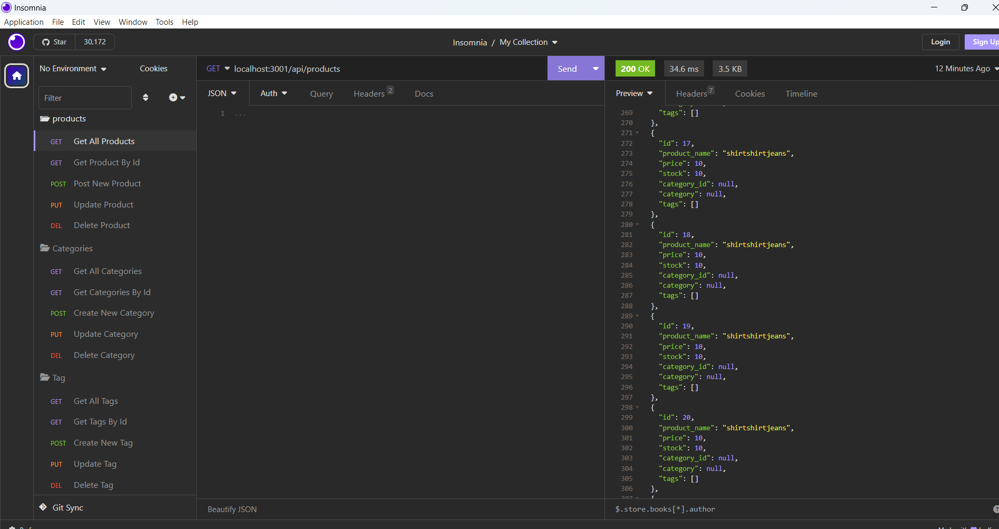
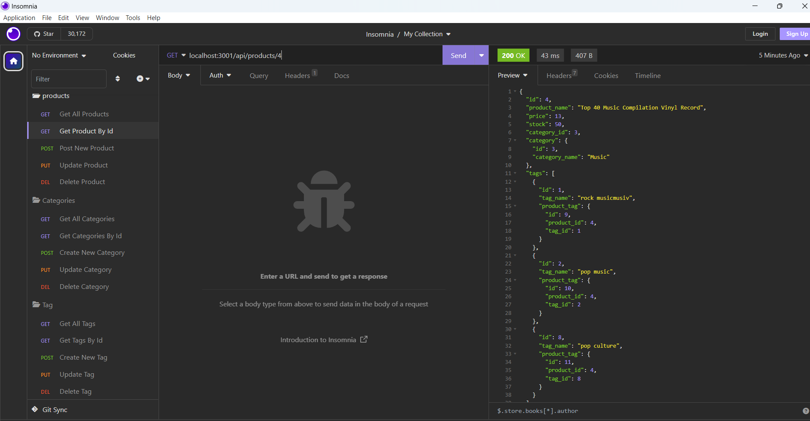
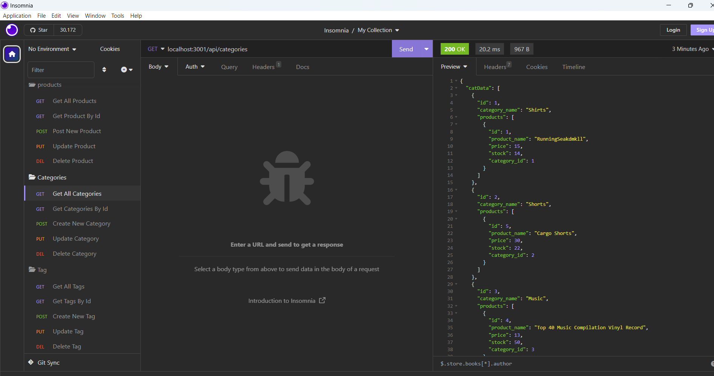
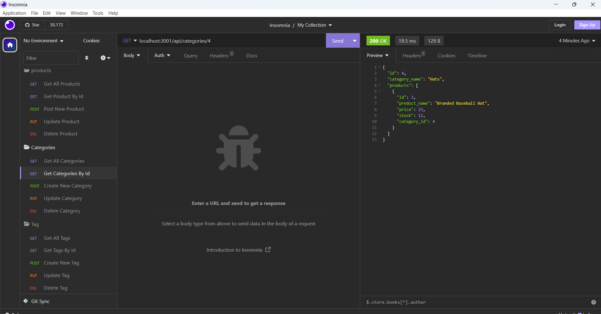
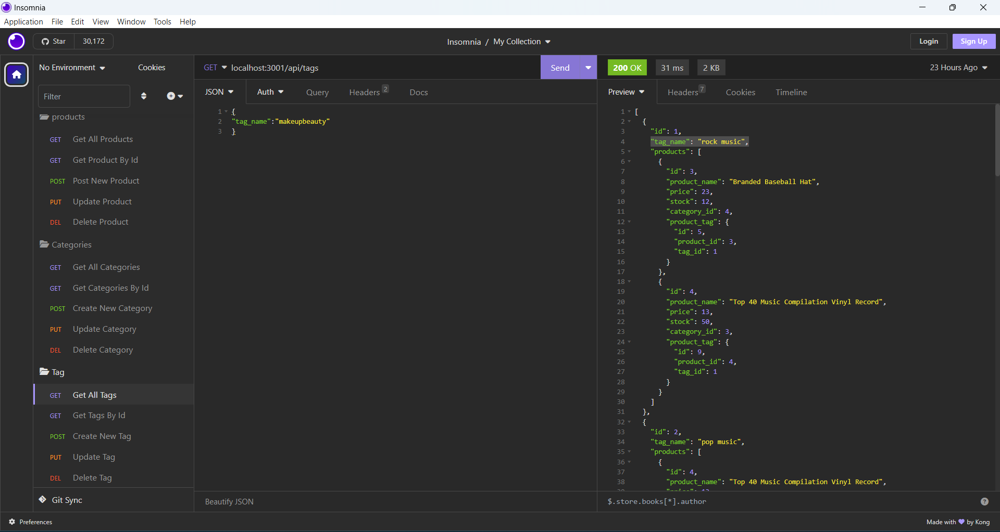
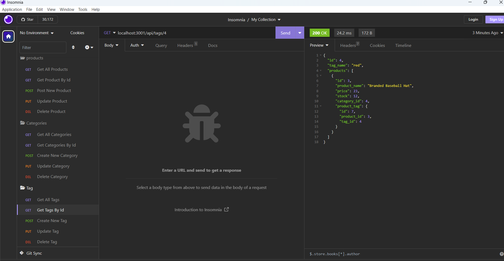

# Employee-Tracker

## Description
This project is based on ecommerce website where they can we create category,products and tags .The main features is that how the relate to each other means how they have conneted to eact other .whole data has been saved in my sql data base with  the help of sequelize package. we can add categroy ,update ,delete it same thing have done with products and product tags ,  i have used package of Node Js,mysql12 .dotenv.This is for ecommerce website where they can manage categories ,products and product tags

# github Repo Link
https://github.com/LipikaManglaa/E-Commerce-Back-End.git

SSH LINK: git@github.com:LipikaManglaa/E-Commerce-Back-End.git

# video Link 
# how can we see results in insomania
https://drive.google.com/file/d/1ss3FQzCm8XhixQHmnrVNtqGttuetgRT6/view

# how can add schema and seed the data
https://drive.google.com/file/d/1W0ThXFi8X31AuPMToJyj8GvDyU-1AKom/view

## Table of Contents

  
* [Description](#Description)

* [Screenshots](#Screenshots) 

* [Technologies-Used](#Technologies-Used)

  
* [Installation](#installation)
  
* [Instructions](#Instructions) 
          
* [Questions](#questions)
 
* [Usage](#usage)

* [License](#license)          

## Installation
1. In order to install this project you must clone this project on to your local machine.

2. To install node.js v18 using the terminal, refer to the documentation for the appropriate command. also install myslq12 for database 

3. After installing node.js v18, use the command "npm init -y" in the terminal to create a package.json file for storing project files

4. you have to install dotenv for .env file .

5. Type "npm start" in the terminal to run the application.

## Usage
This project usage is for anyone that needs a ecommerce website!

## Instructions
If you would like to see how it effects for ecommerce website , can check my github repo and in video , you can see results 

## Screenshots 
  list 0f how results shows

## View Products
   # you can see view all your products 
  

  # you can see view single your product by Id
  

## View categoriess
   # you can see view all your categories 
  

  # you can see view single your category by Id
  

  ## View Products
   # you can see view all your tags 
  

  # you can see view single your tag by Id
  

## License
This application is covered under the MIT license

## Questions
Created by: LipikaManglaa

If you have any further questions please feel free to contact me at lipika.mangla.web@gmail.com